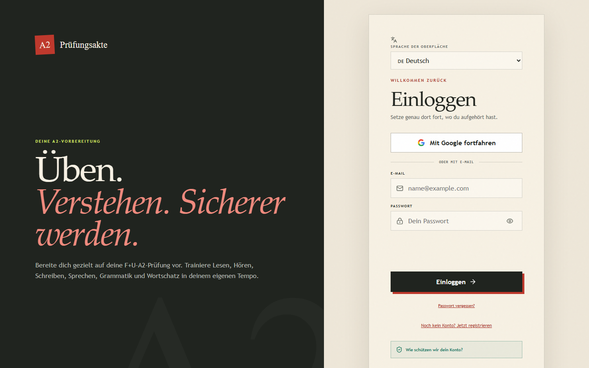

# A2 Preparator extraction pipeline

This workspace turns the uploaded German-learning PDFs into small, locally searchable records. It never loads an entire book into an AI context.

## Learning app

Run `npm.cmd run dev` and open `http://127.0.0.1:5173`. The React app includes:

- twelve A2 curriculum units;
- 1,098 terms extracted from all 12 Übungsbuch vocabulary chapters, plus 64 enriched flashcards;
- separate 60% readiness gates for Lesen, Hören, Schreiben, and Sprechen;
- 34 original skill exercises, including Goethe-Zertifikat A2-style subparts;
- two complete official Goethe practice sets with 40 reading and 40 listening items;
- four official writing tasks and six official speaking parts with guided self-checks;
- responsive task sheets, streamed official audio, and saved practice progress;
- original reading and listening exercises with German text-to-speech;
- heuristic writing and speaking feedback;
- a four-part short simulation;
- persistent local progress, streaks, and activity history.

Create a production build with `npm.cmd run build`. The task types and subparts are aligned to Goethe-Zertifikat A2 patterns, but the readiness score remains an internal training model and is not an official Goethe assessment.

Run `npm.cmd run audit:a11y` for the repeatable Chrome/Axe audit across authentication and all seven app views at desktop and mobile widths. See `QA_CHECKLIST.md` for the remaining manual release checks.

## Pipeline

1. `npm.cmd run inventory` fingerprints the PDFs and selects native text, OCR, or hybrid extraction.
2. `npm.cmd run extract` writes resumable page records under `data/pages/`.
3. `npm.cmd run structure` detects exercise blocks and builds a local MiniSearch index.
4. `npm.cmd run validate` checks completeness, blank pages, and low OCR confidence.
5. `npm.cmd run query -- --text "Wechselpräpositionen"` returns only the best matching records with short snippets.

Run `npm.cmd run ingest:listening` to rebuild the official listening manifests from the local Goethe PDFs and audio files.
Run `npm.cmd run ingest:vocabulary` to rebuild the chapter vocabulary library from the Übungsbuch OCR pages.

Use `node scripts/extract.mjs --book BOOK_ID --pages 10-20` for targeted or resumed extraction. Generated page text and indexes are ignored by Git.

Query filters include `--book BOOK_ID`, `--type exercise`, and `--limit 5`. Add `--full` only when the complete text of the selected records is needed.

All three uploaded books are valid. The extraction index contains 615 pages and 504 detected exercise blocks, including all 196 pages of `Netzwerk Neu A2 Übungsbuch`.

## Screenshots

App desplegada en [https://a2-pruefungsakte.vercel.app](https://a2-pruefungsakte.vercel.app).

