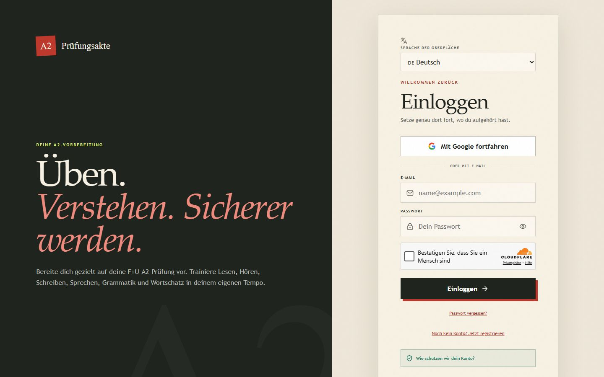
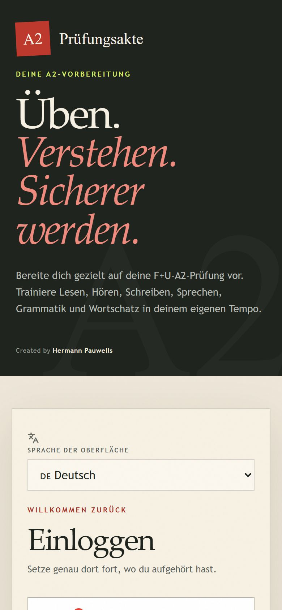

# A2 Prüfungsakte

App web para prepararse al examen de alemán nivel A2 (formato Goethe-Zertifikat A2). Es para quien estudia alemán por su cuenta y quiere practicar las cuatro habilidades, vocabulario y gramática en un solo lugar. La interfaz está en alemán y otros idiomas.

Sitio en vivo: https://a2-pruefungsakte.vercel.app

| Escritorio | Móvil |
| --- | --- |
|  |  |

<sub>La app pide cuenta para entrar, por eso las capturas muestran la pantalla de acceso.</sub>

## Qué incluye

- Doce unidades del currículo A2.
- 1,098 términos de vocabulario sacados de los 12 capítulos de un libro de ejercicios, más tarjetas de estudio.
- Cuatro habilidades por separado (Lesen, Hören, Schreiben y Sprechen), cada una con su meta de preparación del 60%.
- Ejercicios propios y dos exámenes de práctica oficiales de Goethe con 40 preguntas de lectura y 40 de comprensión auditiva, con audio.
- Tareas oficiales de escritura y partes de expresión oral con autoevaluación guiada.
- Entrenador de artículos, gramática y simulacro corto de examen.
- Progreso, rachas y logros guardados, instalable como PWA.
- Herramientas para extraer y buscar texto de los PDFs de estudio de forma local, sin cargar libros completos.

La puntuación de preparación es un modelo interno de entrenamiento, no una evaluación oficial de Goethe.

## Tecnologías

React 19, Vite, Supabase (cuentas y progreso), Cloudflare Turnstile, Tesseract.js y pdf.js para el OCR, MiniSearch para la búsqueda local, Playwright con Axe para las pruebas de accesibilidad. Desplegado en Vercel.

## Cómo correrlo

```bash
npm install
cp .env.example .env
npm run dev
```

Abre `http://127.0.0.1:5173`. Variables de entorno en `.env`: `VITE_SUPABASE_URL`, `VITE_SUPABASE_PUBLISHABLE_KEY`, `VITE_TURNSTILE_SITE_KEY` y `VITE_GOOGLE_AUTH_ENABLED`.

Otros comandos útiles:

```bash
npm run build
npm run audit:a11y
npm test
```

## Extracción de los PDFs

Los PDFs y el texto generado no se suben al repositorio. El flujo es `npm run inventory`, `npm run extract`, `npm run structure` y `npm run validate`. Para buscar: `npm run query -- --text "Wechselpräpositionen"`.

Hay una lista de revisiones manuales antes de publicar en `QA_CHECKLIST.md`.
